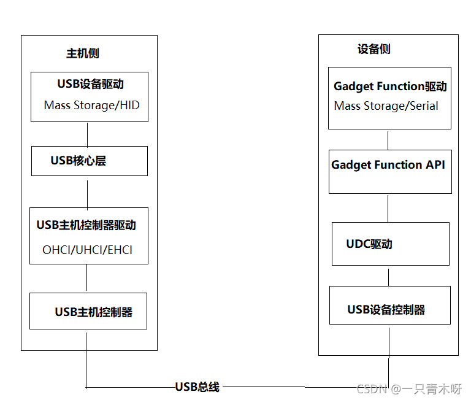

# USB UDC Core
一般介绍比较多的都是soc的USB控制器的介绍，而比较少介绍USB作为设备侧应该如何工作与在内核下是具体的流程。本文就是主要来介绍USB做为设备侧的时候的具体流程与功能的。

## 本文目录
* USB的基础知识与简介
* USB的初始化
* USB的UDC架构
* USB的Gadget驱动
* 参考

# USB的基础知识与简介

在介绍USB的时候，需要先对USB的相关基础知识进行介绍。没有相关的基础知识，是无法进行USB相关的分析的。

## USB的不同速率
具体的速率如下表:

USB 还有不同的速率模式可以分为：

当然后续还有 USB4的一些新规范，在此就不说明了，暂时我们也用不到。

## USB的硬件接口
USB1.0-2.0的接口一般是4个口，分别是VCC、GND、D+、D-.
而USB3.0有些不同，具体如下：

## USB的拓扑接口
大家都知道USBHUB，这就涉及到USB的拓扑结构了。USB的拓展功能让USB具备了强大的接口能力。

一条 USB 总线上可支持 128 个地址，每个设备必须至少配置一个地址。USB root hub是直接连接到主机控制器的特殊设备，不需要配置地址，由于 0 作为默认地址(USB 设备初始化时使用)，所以整个总线做多能支持 127 个设备同时连接

## USB的控制器
USB一般的控制器也有分类。一般是根据USB的不同速率来分配的。

控制器部分在此先不讲述。而USB的设备端是咋么构成的呢？

## USB的设备端
具体可以看以下框图：

USB 设备的构成包括了配置、接口和端点。设备通常具有一个或者多个配置，配置经常具有一个或者多个接口，一个接口经常具有一个或者多个端点

* 配置(Configuration)：USB 设备在使用前必须进行配置(configure)，一个配置是一组功能的集合，主机设置一个配置 ID 来选择某个配置
* 接口(Interface)：一种配置是一组功能的集合，一组功能中每个完整的功能为一个接口
* 端点(EndPoint)：端点是 USB 数据收发的最小单元，除端点 0 外，所有端点只支持单向的数据传输，每个高速 USB 设备最多可以支持 15 组端点(IN/OUT)。

## USB的控制框架图
在了解了一些概念后，应该对于USB的一些名词应该有所记忆了，那么USB它又是如何工作的呢？
下面我们可以看一下框图：

主机侧：主要有USB主机控制器驱动和USB设备驱动。

* USB主机控制器驱动：控制插入的USB设备
* USB设备驱动：控制具体USB设备和主机如何通信

设备侧：主要有UDC驱动和Gadget Function驱动。

* UDC驱动：控制USB设备和主机的通信
* Gadget Function驱动：控制USB设备功能的实现

已经了解了整体的架构，那么USB又是如何在总线中穿梭的呢？

## USB的传输
一般来讲USB有自己的packet，通过相应的协议包进行交互与传输数据。

USB 包可以分为四种类型，分别是 token(令牌包), data(数据包), handshake(握手包), 和special(特殊包)。

包是USB总线上数据传输的最小单位，**不能被打断或干扰，否则会引发错误**。

若干个数据包组成一次事务传输，一次事务传输也不能打断，属于一次事务传输的几个包必须连续，不能跨帧完成。

一次传输由一次到多次事务传输构成，可以跨帧完成。

### USB的包组成
USB包由五部分组成，即同步字段（SYNC）、包标识符字段（PID）、数据字段、循环冗余校验字段（CRC）和包结尾字段（EOP）

#### 同步域（同步字段）
所有的USB包都由SYNC开始，高速包的SYNC宽度为32bit，全速/低速包的SYNC段度为8bit。实际接收到的SYNC长度由于USB HUB的关系，可能会小于该值。八位的值固定为0000 0001，用于本地时钟与输入同步。
如下：

#### PID
而根据USB的协议，PID（8BIT）是判断USB包类型的依据，其只使用低4位，高4位是用于取反校验的。
具体如下：

#### 地址域
同步域中第一条有ADDR（7bit）与ENDP(4bit)就是地址域
低7位是设备地址 高4位是端点地址

#### 帧号
共11位，每一帧都有特定的帧号，帧号域最大有0x800的容量

#### 数据
长度为0~1023字节，在不同的传输类型中，数据域的长度各不相同。

#### 校验域CRC
对令牌包和数据包中非PID域进行校验

### USB的包类型
前面有说到PID，那么不同类型的USB又有哪些不同呢？

#### 令牌包

跟普通的包主要的如下：

* OUT: 通知设备将要输出一个数据包
* IN:通知设备返回一个数据包
* SETUP:只用在控制传输中，也是通知设备将要输出一个数据包，与OUT令牌的区别：只使用DATA0数据包，且只能发给device的控制端点

与前面不同的是：

SOF数据包由主机以高速总线的标称速率每1.00ms发出一次，对于高速总线则为125us,SOF数据包是一个PID指示数据包类型，后面跟一个11位的帧号字段,它没有地址与与数据，只有帧号

#### 数据包
数据包由PID，包含零个或多个字节数据的数据字段和CRC组成。

可以分为DATA0包和DATA1包，当USB发送数据的时候，如果一次发送的数据长度大于相应端点的容量时，就需要把数据包分为好几个包，分批发送，DATA0包和DATA1包交替发送

#### 握手包
仅由PID组成，握手包用于报告数据事务的状态

### USB的传输类型
一个传输有多个事务组成，一个事务由2/3个包组成
传输又可以被分为4类：批量传输、等时传输、中断传输、控制传输

#### 控制传输
控制传输由2~3个阶段组成建立阶段->数据阶段->状态阶段

每一种事务可分为三个阶段，令牌阶段、数据传输阶段、握手阶段

#### 批量传输
批量传输又是可靠的传输，需要握手包来表明传输的结果。若数据量比较大，将采用多次批量事务传输来完成全部数据的传输，传输过程中的数据包的PID需要按照DATA0-DATA1-DATA0.....的方式翻转，用以保证发送端和接收端的同步

#### 中断传输
中断传输由IN或OUT事务组成，中断传输在流程上除不支持PING 之外，其他的跟批量传输是一样的。
他们之间的区别也仅在于事务传输发生的端点不一样、支持的最大包长度不一样、优先级不一样，主机在排定中断传输任务时，会根据对应中断端点描述符中指定的查询间隔发起中断传输。

注意：中断传输的方式主要是用于对设备的查询，以确认是否有数据需要传输。因此中断传输的方向总是从USB设备到主机，DATA0和DATA1中包含中断信息，而不是中断数据

#### 同步传输

同步传输是不可靠的传输，所以它没有握手包，也不支持PID翻转，主机在排除事务传输时，同步传输时最高优先级。同步传输适用于必须以固定速率抵达或者在指定时刻抵达，可以容忍偶尔错误的数据上。如实时传输的麦克风、喇叭、UVCCamera

实时传输只需要令牌与数据两个信息包阶段，没有握手包，故数据传错时不会重传。

# USB的初始化
上章节基本已经将USB的协议与基础都已经讲了，带着这些基础，走进Linux的USB初始化大门吧。
要了解USB的初始化，我们得先看一下代码结构，好让我们知道如何下手：

## USB的代码入手

具体代码一般放在drivers/usb中。

看到core，common,必然要眼前一亮，那么主要应该就是这个了。

### Core
这部分主要是放初始化整个USB系统，初始化ROOTHUB，初始化主机控制器的代码。

在linux中使用lsmod就可以看到usbcore，这个就是LinuxUSB子系统的核心，然后还能看到ehci_hcd，这个是主机控制器模块

USB Core 主要负责核心功能，为别的设备驱动程序提供服务，提供一个用于访问和控制USB硬件的接口，而不用去考虑当前系统存在何种主机控制器,具体的框架应该如下：

所以这个必然是我们需要分析的重点。

### host
这部分主要放主机控制器的代码，这个主要是去实现不同主机的控制器

### gadget
这部分主要是放配件驱动的，用于控制外围设备作为一个USB设备与主机通信，其大致上被分为UDC驱动与gadget驱动以及CDC class通用协议
